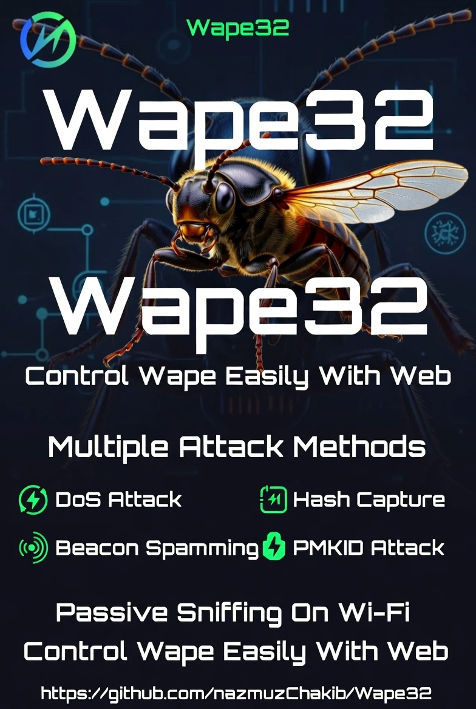

# WAPE32 Wi-Fi Pentesting tools

This project introduces an universal tool for ESP32 platform for implementing various Wi-Fi attacks. It provides some common functionality that is commonly used in Wi-Fi attacks and makes implementing new attacks a bit simpler. It also includes Wi-Fi attacks itself like capturing PMKIDs from handshakes, or handshakes themselves by different methods like starting rogue duplicated AP or sending deauthentication frames directly, etc...

Obviously cracking is not part of this project, as ESP32 is not sufficient to crack hashes in effective way. The rest can be done on this small, cheap, low-power SoC.

## Features
- **PMKID capture**
- **WPA/WPA2 handshake capture** and parsing
- **Deauthentication attacks** using various methods
- **Denial of Service attacks(DoS)**
- Formatting captured traffic into **PCAP format**
- Parsing captured handshakes into **HCCAPX file** ready to be cracked by Hashcat
- Passive handshake sniffing
- Easily extensible framework for new attacks implementations
- ESP32_tools for easy configuration on the go using smartphone for example
- And more...

<p>
    
</p>

## Usage
1. [Build](#Build) and [flash](#Flash) project onto ESP32 (DevKit or module)
1. Power ESP32
1. ESP32_tools is started automatically after boot
1. Connect to this AP\
By default: 
*SSID:* `ESP32_tools` and *password:* `xnBD2k25`
1. In browser open `192.168.4.1` and you should see a web client to configure and control tool like this:

    ![Web client UI] // will update here on fina; project

## Flash
If you have setup ESP-IDF, the easiest way is to use `idf.py flash`.

In case you don't want to setup whole ESP-IDF, you can use pre-build binaries included in [`build/`](build/) and flash them using [`esptool.py`](https://github.com/espressif/esptool) (requires Python).

Example command (follow instructions in [esptool repo](https://github.com/espressif/esptool)):
```
esptool.py -p /dev/ttyS5 -b 115200 --after hard_reset write_flash --flash_mode dio --flash_freq 40m --flash_size detect 0x8000 build/partition_table/partition-table.bin 0x1000 build/bootloader/bootloader.bin 0x10000 build/esp32-wifi-penetration-tool.bin
```

On Windows you can use official [Flash Download Tool](https://www.espressif.com/en/support/download/other-tools).

### Further reading
* [Academic paper about this project (PDF)](https://excel.fit.vutbr.cz/submissions/2021/048/48.pdf)

## Hardware 
This project was mostly build and tested on **ESP32-DEVKITC-32E**
but there should not be any differences for any **ESP32-WROOM-32** modules.

## Similar projects
* [GANESH-ICMC/esp32-deauther](https://github.com/GANESH-ICMC/esp32-deauther)
* [SpacehuhnTech/esp8266_deauther](https://github.com/SpacehuhnTech/esp8266_deauther)
* [justcallmekoko/ESP32Marauder](https://github.com/justcallmekoko/ESP32Marauder)
* [EParisot/esp32-network-toolbox](https://www.tindie.com/products/klhnikov/esp32-network-toolbox/)
* [Jeija/esp32free80211](https://github.com/Jeija/esp32free80211)

## Disclaimer
This project demonstrates vulnerabilities of Wi-Fi networks and its underlaying 802.11 standard and how ESP32 platform can be utilised to attack on those vulnerable spots. Use responsibly against networks you have permission to attack on.

## Notice
For secutity, we dont share source code for publicly. It's can be used in unethical attacks. 

## License
Even though this project is licensed under MIT license (see [LICENSE](LICENSE) file for details), don't be shy or greedy and share your work.
